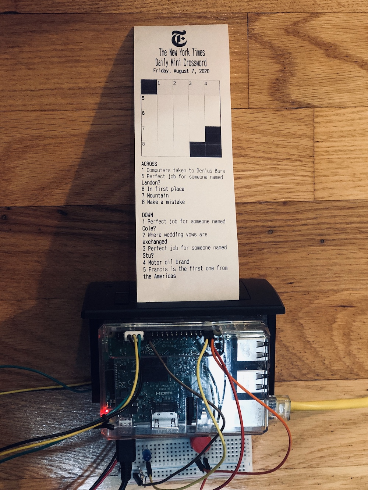
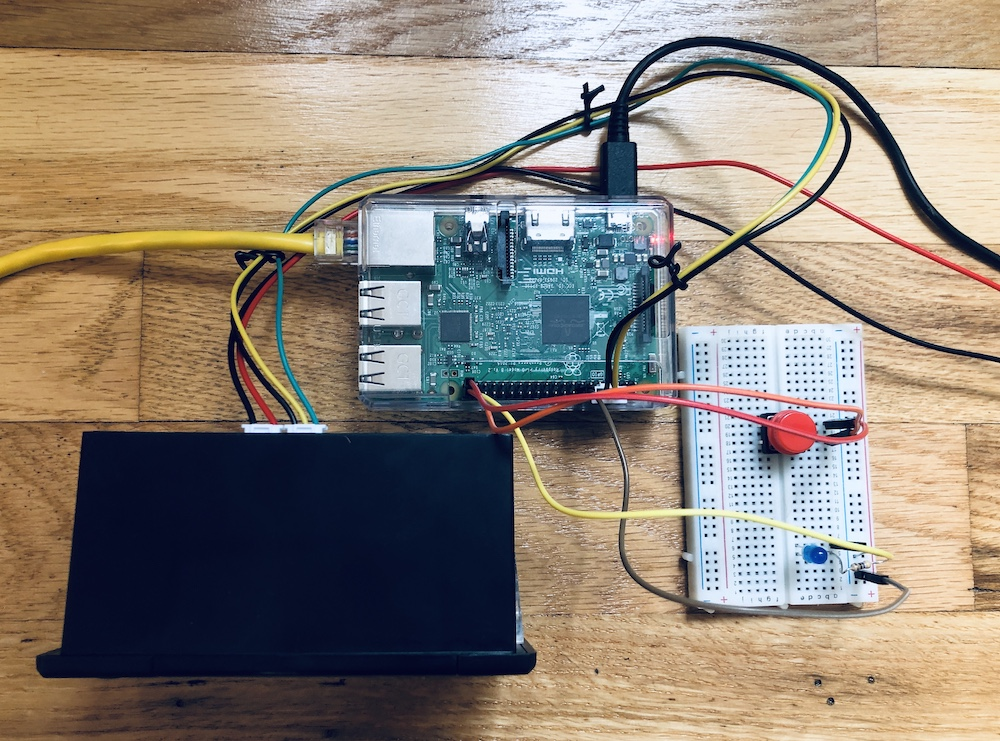

# NYT Mini Bot
Oh, hi. I'm a little pi bot that prints out the [New York Times Mini Crossword](https://www.nytimes.com/crosswords/game/mini) of the day for your analog xwordin' delight.

My creation was inspired by the [Vomit Comic Robot](https://imgur.com/a/hhrnQoC#TblkXme).

## Make me at home!

### Hardware
- [Raspberry Pi 3 Model B](https://www.raspberrypi.org/products/raspberry-pi-3-model-b)
- [Adafruit Mini Thermal Receipt Printer Starter Pack](https://www.adafruit.com/product/600)
- Micro SD card
- 5V 3A Power Supply Charger
- Ethernet cable

*For button and light functionality*
- LED
- push button
- female-to-male jumper wires x4
- resistor
- breadboard

### Headless Raspberry Pi + thermal printer setup
1. Flash a [Raspberry Pi OS](https://www.raspberrypi.org/downloads/raspberry-pi-os/) image to micro SD card with [Etcher](https://www.balena.io/etcher) (note: don't need the version with the extra 'recommended software', but may need at least the full vs lite image)
1. Enable SSH on the rpi by adding a blank `ssh` file in the `/boot` directory of the SD card
1. Connect the rpi power supply and insert the SD card 
1. Connect ethernet cable between the rpi and router
1. SSH into the rpi
1. Follow [Adafruit’s tutorial](https://learn.adafruit.com/networked-thermal-printer-using-cups-and-raspberry-pi/connect-and-configure-printer) to connect and configure the rpi to the printer

### LED and button trigger
// TODO

### NYT Mini Bot scripts
*Requirements: npm, Node v14+, Python 3.7+ (pre-installed on newer rpi OS images)*

#### xword-fetcher.js script
Using [Puppeteer](https://github.com/puppeteer/puppeteer), this Node script navigates to the NYT Mini page, takes a screenshot of the crossword board, and saves the date/clues to a text file.

To test out in isolation, run `npm run start`

#### xword-printer.py script
This Python script executes the xword-fetcher script, connects to the thermal printer using the [Adafruit Python Thermal Printer library](https://github.com/adafruit/Python-Thermal-Printer), and prints out the puzzle retrieved by xword-fetcher.

1. SSH into the rpi and clone this repo
1. Run `./install.sh` (note: the first sections of this install script overlaps with the printer tutorial steps from above; can skip. Just make sure the `Python-Thermal-Printer/Adafruit_Thermal.py` file is copied within the nyt-mini-bot repo)
1. Run `./xword-printer.py`
1. Press the button!